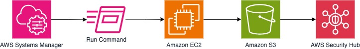

# aws-openscap-securityhub

### 1. [OpenSCAP_SecurityHub](https://github.com/sgonza20/aws-openscap-securityhub/tree/main)

Description: Executes OpenSCAP compliance scans on EC2 instances and sends the results to Security Hub.

Technologies Used: SSM, S3, EC2, Lambda, OpenSCAP, Security Hub

Instructions: Deploy the create-scap-automation.yml CloudFormation template to create the necessary IAM roles, Lambda function, S3 bucket and trigger. Edit the Lambda function code to point to your SCAP profile and Security Hub configuration. Test by launching an EC2 instance and verifying results in Security Hub. 

...

